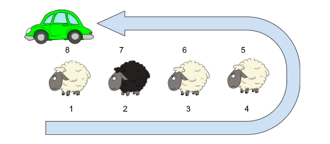

## Comptar Ovelles per Color

### Descripció:
Programa en C# que compta el nombre d’ovelles blanques, negres i blanc-i-negres observades en un viatge en cotxe, tenint en compte que:

Es veu cada ovella des de dos costats (primer gir i segon gir del cotxe).

El segon costat s’observa en ordre invertit, corresponent a cada ovella del primer costat.

Una ovella es classifica com:

**Blanca** si els dos costats són blancs.

**Negra** si els dos costats són negres.

**Blanc-i-negra** si els costats són diferents.

La llista d’ovelles ha de tenir un nombre parell d’elements; si no, el programa indica que la llista no és vàlida.

### Objectiu:
Donada una llista de colors, el programa calcula quantes ovelles hi ha de cada tipus i les mostra per pantalla.
> Aquest exercici i els dibuixos els creat en Xavier Sala --- [@utrescu](https://github.com/utrescu) 
